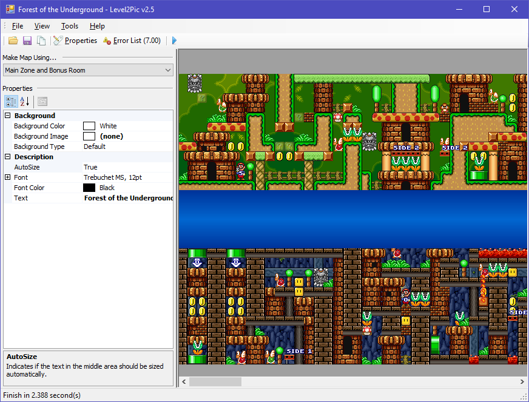
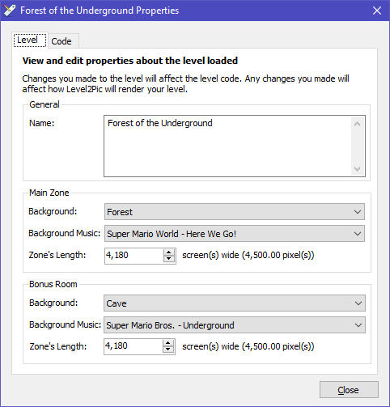
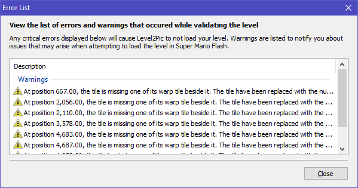

# Level2Pic

Level2Pic is a simple desktop app that allows you to make maps of levels made in Super Mario Flash v3.0, a fan-made Mario game by [pouetpu](http://www.pouetpu-games.com/).

## Features

* Load levels from a Super Mario Flash v3.0 level code directly or from a website
* See a preview of your level map before saving it or copying it to a clipboard
* View interesting information or statistics about a level

### Screenshots

 

## License

The project code is licensed under the MIT License. For more information, see [LICENSE.md](LICENSE.md) that is in the repository.

Super Mario Bros. is a trademark and property of Nintendo. All assets and sprites that are used for making level maps are property of Nintendo. All rights reserved of their respective owners. This project is neither affiliated nor endorsed by Nintendo or pouetpu.

## Background

I initially started this project back when I was obsessed with Super Mario Flash around 2010 - 2011. 

Back in the day, I used to frequent (the now defunct) Super Mario Flash / Super Mario Flash Extra Forums and post my Super Mario Flash levels there for people to play and/or rate. One of the things I would also do was post a map of the levels I've made so that people can get a good look of what to expect while playing my levels.

To make these level maps, I would initially take section-by-section screenshots of the level with Super Mario Flash level editor, and stitch it all together using Paint.NET, and then post the level map. The whole stitching process to create a level map was painfully slow. Then suddenly, I had the realization that I could easily automate through the power of C# programming, and that's how Level2Pic was born. 😄

Since then, I haven't been maintaining this project as life got in the way and I lost interest in Super Mario Flash. ☹ Given the fact that I started this project back when I was still getting the ropes of programming, there are bound to be silly and/or bad practice/design/engineering choices in this codebase. In fact, while reading through my own code now (in 2018), there's a lot moment where I've given myself a _face-palm_. 😅 If anything though, I want to say that the experience I gained from this project served as a stepping stone for me to become a better programmer in the process. 🙂